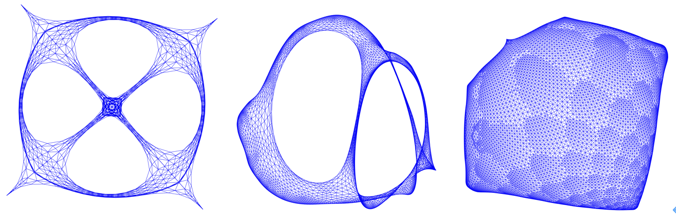
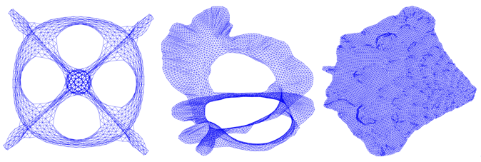
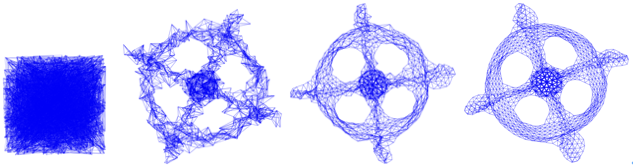
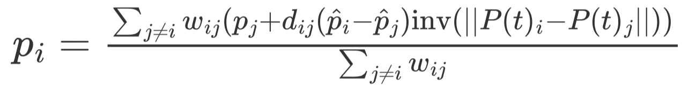

# 		Tired of Over-smoothing? 

# Stress Graph Drawing Is All You Need!

**Binary Stress Function:**

$\text{B}(p)=\sum_{<i,j>\in E}||p_i-p_j||^2+\theta(||p_i-p_j||-1)^2$

where $\theta$ is the balance coefficient. The first item emphasizes the local structure by making the graph layout of connected nodes more compact, while the second item strives to distribute all nodes evenly within a circle.

**Binary Stress Graph Drawing**

  

**Full Stress Function:**

$\text{Stress}(P)= \sum_{\in E}w_{ij}(||P_i-P_j||-d_{ij})^2+\sum_{\in { V \choose 2 }\backslash E}w_{ij}(||P_i-P_j||-d_{ij})^2$

 The first item is called attractive forces, which tend to shorten edges and maintain the compactness of connected nodes. Repulsive forces in the second item keep all nodes $V$ well separated. $d_{ij}$ is the shortest path distance.

**Full Stress Graph Drawing**:

  

**Sparse Stress Function:**

  Ortmann et al. proposed the sparse stress function to reduce the high computations in the full stress method. They restrict the stress computation of each node $i$ to a set of representative nodes $\mathcal{P}$, from now on called pivots. The simplified stress function has the following form:

$\text{Sparse}(X)= \sum_{\in E}w_{ij}(||X_i-X_j||-d_{ij})^2+\sum_{i\in V}\sum_{p \in \mathcal{P}\backslash N_i}w_{ip}(||X_i-X_p||-d_{ip})^2$

**Sparse Stress Graph Drawing**:

  

Position-aware GNNs v.s. Spase Repulsion GNNs:

| Proposed  in 2002                                            | Proposed  in 2019                                            |
| ------------------------------------------------------------ | ------------------------------------------------------------ |
| **Pivot Selection** $(G(V={1,…,n},E),  m)$  % This function finds $m$ pivots     Choose node $p_1$ randomly from $V$     dist[1,…,n]$\leftarrow\infin$ % a distance recording list     **for** $i = 1$ to $m$ **do**         % Compute the shortest path distance         $\mathcal{D_{p_i*}}\leftarrow BFS(G(V,E),p_i)$        **for every** $j\in V$           dist[j]$\leftarrow$min{dist[j], $\mathcal{D_{j}}$ }         **end for**     %Choose next pivot    $p_{i+1}\leftarrow$ arg max$_{j\in V}${dist[j]}    **end for**     **return** $p_1,p_2,...,p_m$ | **Anchor Selection** $(G(V={1,…,n},E),  t)$   % This function finds $t$ anchor-sets       Set anchor-size = $\text{int}(n/(2^{j+1}))$                                  $,j=0,1,...,log_n-1$       Each size is chosen for $clog_n$ times                                  $,c=0.5,1,...$       Randomly sample $t=clog_n^2$ anchor-sets                                   $,S=\{S_1,S_2,...S_t\}$       **for** $i = 1$ to $t$ **do**            % Compute the shortest path distance           $\mathcal{D}_{S_i*}\leftarrow BFS(G(V,E),S_i)$          Choose the closest anchor for each node        **end for**        **return** ($v$, $s$), $v\in V,s\in S_i$ |

**Stress Iteration:**

  

 The current message passing mechanism( $\sum_{j\ne i}w_{ij}p_{ij}$) in GNNs is only a small part of the stress Iteration. Our story starts at optimizing the stress iteration!

## **🪧Our main contribution is to answer the following questions:**

1. What is the geometric process of message passing?
2. What is over-smoothing?
3. How to build a deep GNN?
4. Is the model depth a resource or a burden on GNNs?
5. How to optimize message passing according to stress graph drawing?

## My Experiment Environments
* [Python = 3.7](https://www.python.org/)
* [Pytorch = 1.5.0](https://pytorch.org)
* [Pytorch_Geometric = 1.5.0](https://pytorch-geometric.readthedocs.io/en/latest/)
* [Cuda = 10.2](https://pytorch.org)
* [GPU-> 'TITAN RTX'](https://pytorch.org)
* Recommend: Use jupyter notebook to see our ipynb file (not in GitHub!!)

## Code Architecture：We will upload the code later！
    .F o l d e r
    ├── img                    # images for readme.md
    ├── data                   # benchmark networks 
    ├── Experiments 👇
    Experiment-Files:
       ├── Github_Linear_Attractive_Models.ipynb                 
       ├── Github_Nonlinear_Attractive_Models.ipynb					
       ├── Github_Repulsive_Models.ipynb
       ├── Github_Virtual_Pivot_Models.ipynb
       ├── Github RWN-DA-DAD Random Test.ipynb
       ├── Github GCN-SAGE Random Feature Test.ipynb
    Other-Files:
       ├── RWN.py
       ├── D_A_D.py
       ├── RWN_5_60_cora_300.txt
       ├── DA_5_60_cora_300.txt

